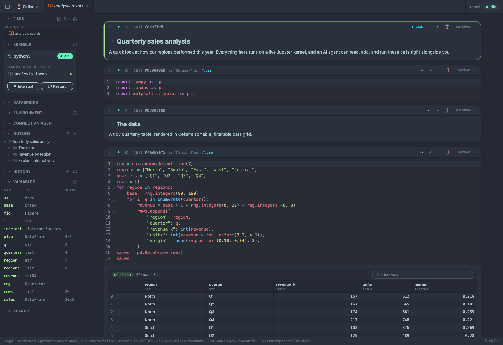
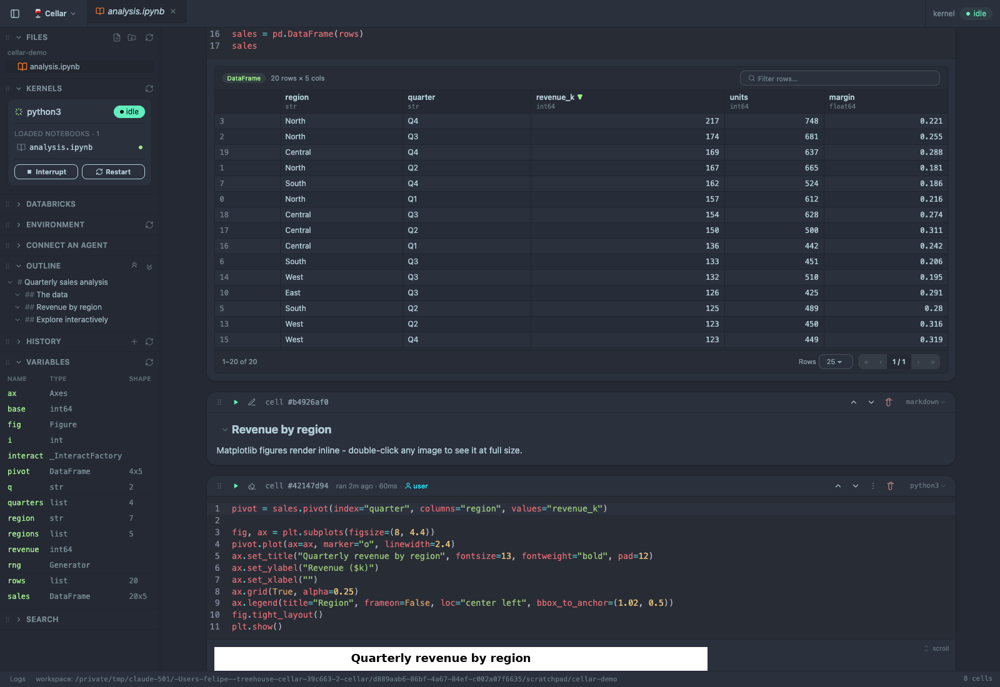
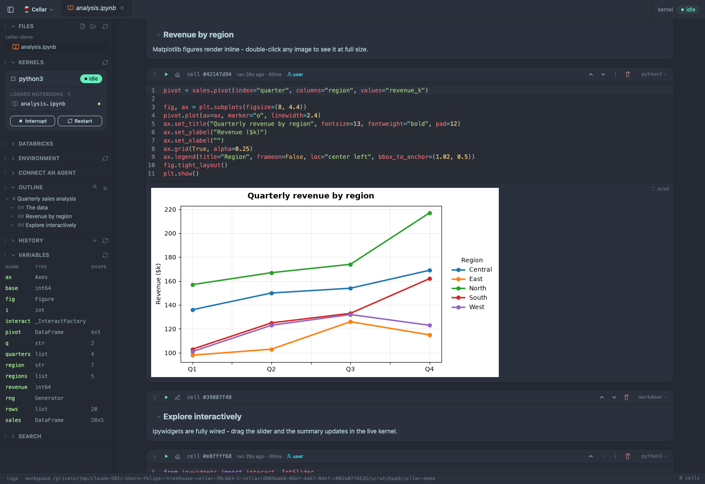

# Cellar

[](https://github.com/fbereilh/cellar/actions/workflows/ci.yml)
[](LICENSE)
[](https://github.com/fbereilh/cellar/releases)

**A Python notebook built for you and your AI agent to share.**

Cellar runs an interactive notebook in your browser on one shared Jupyter kernel, with a first-class agent interface built in. Open a folder and both you and an AI agent (like Claude Code) work the *same* live notebook: the agent adds and runs cells, and the results stream into your browser in real time. No copy-paste, no context handoff, no drift.

It saves ordinary `.ipynb` files that open in vanilla Jupyter, and it keeps them git-clean so your diffs stay meaningful.



<p align="center"><em>One live notebook, one shared kernel - markdown, code, and rich outputs, with an outline and live kernel inspector alongside. (Shown in the dark theme; a light theme ships too.)</em></p>

## Why Cellar

- 🤝 **You and your agent, one notebook.** An agent's runs and edits appear live in your open tab (streaming output, run badges, structural changes), and your edits flow back the same way. You are never looking at stale state.
- ⚡ **One command, zero setup.** Run `cellar` in any folder. It resolves (or creates) the project venv with [`uv`](https://docs.astral.sh/uv/), starts the kernel, and opens your browser.
- 🔌 **Zero-config agent connection.** Cellar drops a `.mcp.json` in your workspace, so an agent opened in that folder connects automatically over MCP. Nothing to wire up.
- 🧹 **Git-friendly by design.** Clean-on-save strips volatile metadata and normalizes outputs, so re-running a notebook with the same results produces *no* git diff.
- 📊 **Rich outputs and data tools.** Matplotlib, Plotly, HTML, and full-size images render inline; sort and filter DataFrames in an interactive grid, and inspect the live namespace without leaving the page.
- 🧱 **Databricks, natively.** Point-and-click connect binds `spark` and a `WorkspaceClient` in the kernel and gives you a Unity Catalog browser.

## Install

**Homebrew (recommended).** Trust the formula once, then pick a channel:

```sh
brew trust --formula fbereilh/cellar/cellar
```

**Stable** - the latest tagged release. Recommended for most people:

```sh
brew install fbereilh/cellar/cellar
```

**Latest** - tracks `main` for the newest work, for the adventurous:

```sh
brew install --HEAD fbereilh/cellar/cellar
```

> **Why trust?** Homebrew requires a one-time trust before it will load a third-party tap's formula; `--formula` trusts just this one (recommended). The install then auto-taps `fbereilh/cellar` for you, so there's no separate `brew tap` step.

```sh
cellar --update
cellar --version
```

`cellar --update` fetches the newest version (install-method aware); `cellar --version` prints the version, sha, and install method.

<details>
<summary>From a git clone (dev)</summary>

```sh
git clone https://github.com/fbereilh/cellar.git
cd cellar
make setup
```

`make setup` installs deps, builds, and links `cellar` onto your PATH. `make update` (or `cellar --update`) pulls and rebuilds; run `make` with no target to list all commands.

For the full clone-to-run walkthrough, the kernel/venv resolution order, and every configuration knob, see **[docs/SETUP.md](docs/SETUP.md)**.
</details>

## Uninstall

Installed via Homebrew? Remove Cellar, then clean up what it pulled in:

```sh
brew uninstall cellar
brew autoremove
```

Use the fully-qualified `brew uninstall fbereilh/cellar/cellar` if another tap also provides a `cellar` formula.

> **Is `brew autoremove` safe?** Yes - it only removes formulae that were installed as another formula's dependency and are no longer needed by anything. Packages you installed on request are never touched, so a directly-installed `node` or `uv` stays. Run `brew autoremove --dry-run` first if you want to see the list before anything is removed.

## Run with Docker

Prefer to skip installing anything? If you have Docker, you have Cellar. This path needs **only Docker on the host** - no Node, Python, or `uv` - and bakes a **reproducible, pinned kernel environment** into the image so every run is identical. It's meant for single-user, reproducible, zero-prerequisite use: Cellar has one shared kernel and no auth, so it is **not** for multi-user hosting.

Build the image once, then point it at any project folder:

```sh
git clone https://github.com/fbereilh/cellar.git && cd cellar
docker build -t cellar .

# from the project you want to work on:
docker run --rm --init \
  -v "$PWD":/workspace \
  -p 8888:8888 -p 39587:39587 \
  cellar
```

Open **http://localhost:8888** (the container prints it on startup) and you're in. Your folder is mounted at `/workspace`, so edits, new notebooks, and exports land straight back in it. `Ctrl-C` (or `docker stop`) shuts everything down cleanly.

Prefer Compose? It mounts the current directory and publishes both ports for you:

```sh
docker compose up --build   # then open http://localhost:8888
```

Once the image is published to a registry, you can skip the build entirely:

```sh
docker run --rm --init -v "$PWD":/workspace -p 8888:8888 -p 39587:39587 ghcr.io/fbereilh/cellar:latest
```

**The reproducible pinned env.** The image bakes a `uv`-managed virtualenv at `/opt/cellar-kernel` from [`docker/kernel-requirements.txt`](docker/kernel-requirements.txt) - a version-pinned scientific stack (`ipykernel`, `ipywidgets`, `numpy`, `pandas`, `matplotlib`, `scipy`) - and binds the Cellar kernel to it. Every container runs the exact same kernel env, with no network access at start. To make it yours:

- **Rebuild with your own pins** (the primary path): edit `docker/kernel-requirements.txt`, then `docker build -t my-cellar .`. Swap the base or tool versions with build args, e.g. `--build-arg NODE_IMAGE=node:22-bookworm-slim`.
- **Ad-hoc extras without a rebuild**: mount a requirements file and point `CELLAR_REQUIREMENTS` at it - `-v "$PWD/requirements.txt":/reqs.txt -e CELLAR_REQUIREMENTS=/reqs.txt` - and the entrypoint installs them into the kernel venv at startup (needs network).

**Connecting an agent.** The MCP endpoint is published on **http://localhost:39587/mcp** (Streamable HTTP). Point an HTTP-capable MCP client at it. (The in-container `cellar mcp` stdio bridge isn't used from the host, so the image writes no `.mcp.json` by default; set `-e CELLAR_MCP_CONFIG=1` to opt back in for an agent running *inside* the container.)

**Why this image, not a Jupyter base?** It's self-contained (Node + `uv` + Python, multi-stage build) rather than built on a `jupyter/docker-stacks` conda image. Cellar is `uv`-first by design - it manages every venv through `uv` - so a conda base would bolt on a second package manager Cellar never uses, and docker-stacks ships no Node. The container runs isolated (`CELLAR_ISOLATED=1`, no host registry or reaper), non-root, with fixed published ports and the app/MCP bound to `0.0.0.0`.

**Good to know (the honest caveats):**

- The kernel environment is the **container's** baked env, not a host `.venv`. Point Cellar at a different one by rebuilding, or with `-e CELLAR_VENV=/workspace/.venv` (it will `uv`-install `ipykernel` there at startup if missing).
- **Databricks** needs `~/.databrickscfg` mounted read-only (`-v "$HOME/.databrickscfg":/home/cellar/.databrickscfg:ro`, or uncomment the line in `docker-compose.yml`). A **PAT** profile works headless; OAuth's browser flow is awkward inside a container.
- Git blame and diff features need the repo mounted - it is, via `/workspace`.
- **Linux uid:** files are written as uid 1000 by default. If your host user differs, add `--user "$(id -u):$(id -g)"` so mounted files stay owned by you. (macOS Docker Desktop handles this for you.)
- **Single-user only** - don't expose the ports beyond `localhost`.

## Quick start

```sh
cd your-project
cellar
```

Your browser opens to a clean, empty workspace. Click **New notebook** (or open an existing `.ipynb` from the sidebar) and start writing and running cells. To bring in an agent, just open one (e.g. Claude Code) in the same folder - it auto-connects through the `.mcp.json` Cellar wrote, and you can watch it work alongside you.

`Ctrl-C` stops everything. Run `cellar ../other-repo` to open a different folder without `cd`-ing.

## Features

Everything you'd expect from a notebook, plus the things that make sharing one with an agent feel natural:

- **Code, Markdown, and SQL cells**, with a run queue, live run status, and staleness tracking so you always know what's fresh.
- **Rich outputs**: matplotlib, Plotly, rich HTML, and images you can double-click to view at natural size.
- **Interactive DataFrame grid**: pandas frames become a sortable, filterable, paginated table instead of a static repr.
- **Run metadata** on every cell: when it last ran, how long it took, and who ran it (you or an agent).
- **Checkpoints and undo** for agent actions - snapshot before a risky change and roll back.
- **Command palette** and Jupyter-style modal keyboard shortcuts for fast navigation.
- **Find in notebook** with `Ctrl`/`Cmd-F` - search across cell source, rendered markdown, and outputs (with regex), and jump between highlighted matches.
- **Variable and DataFrame inspection** to peek into the live kernel namespace.
- **Git blame and diff gutters** right in the editor, and per-cell change bars in the notebook.
- One shared kernel across notebooks, with a sidebar showing what's actually loaded in memory.



<p align="center"><em>A bare <code>df</code> becomes an interactive grid - click a header to sort, type to filter, page through the rows.</em></p>



<p align="center"><em>Matplotlib, Plotly, and HTML outputs render inline, right where you ran the cell.</em></p>

## Working with agents (MCP)

Cellar exposes an in-process **MCP server** that shares the live document and kernel with the UI. Point any MCP client at the stdio command:

```sh
claude mcp add cellar -- cellar mcp
```

(or just run `cellar` and let the auto-written `.mcp.json` do it). On connect, the agent gets a house-style doctrine that frames the work as building *one coherent notebook*, plus a rich tool set: read the notebook map and live kernel state, add/edit/move cells, and run them (`add_and_run` is the preferred write-and-execute flow). Because the MCP session is independent of the kernel connection, restarting the kernel never drops the agent's session or your document.

## Databricks

Open the sidebar's **Databricks** section, pick a profile and cluster, and click Connect. Cellar binds `spark` (a Databricks Connect session) and `w` (a `WorkspaceClient`) into the kernel, ready for `spark.read.table(...)`. A lazy Unity Catalog `catalog > schema > table` browser lets you click a table to drop a real, editable query cell into the notebook. Auth uses the SDK's own `~/.databrickscfg` profiles (PAT or OAuth) - no extra CLI required. The connected view shows the cluster name and connection status; if a session goes idle or drops, a **Reconnect** button restores it against the same cluster you already chose. Agents can see and query the connection too, and can restore a dropped session or connect to a cluster you point them at - but they never start compute or drive the OAuth browser, so a stopped cluster or a browser sign-in stays your call. While a query runs, a live Databricks-style progress bar shows overall task completion across stages and clears when the query finishes (queries faster than a couple of seconds skip the bar, just like Databricks).

A **SQL cell** holds a raw query that Cellar runs against that `spark` session and renders as an interactive grid. Its result is bound to `_sql_df` in the kernel, so a following Python cell can chain off the last SQL result. `_sql_df` is last-write-wins across the notebook, so with more than one SQL cell, name the binding by opening the cell with a `-- >> sales_df` line:

```sql
-- >> sales_df
SELECT region, sum(amount) AS amount FROM sales GROUP BY region
```

The result then binds to `sales_df` (and still to `_sql_df`), and no later SQL cell clobbers it. The line is a plain SQL comment, so the cell still reads as SQL anywhere else; it must be the first non-blank line, and the name must be a valid Python variable name that isn't already Cellar's (`spark`, `w`) - an unusable name fails the cell with a message saying why. Staleness knows about the binding: edit the query and the Python cells using its result go stale.

## Requirements

- **Node 18+**
- **Python 3.9+**
- **[`uv`](https://docs.astral.sh/uv/)** on your `PATH` (Cellar uses it for all venv and package management)

Or **just Docker** - see [Run with Docker](#run-with-docker) for a zero-prerequisite, reproducible-env alternative.

Cellar runs with **zero configuration** - it discovers your home directory, its own install location, and free ports at runtime. For the clone-to-run steps, kernel/venv resolution, and the full environment-variable reference (all optional, with defaults), see **[docs/SETUP.md](docs/SETUP.md)**.

## Testing

Two layers, run with:

```bash
npm run test
npm run test:e2e
```

- **Unit tests** (`tests/unit/`) guard the pure server logic. The crown jewel is clean-on-save: idempotent, git-clean round-trips, the metadata allowlist, memory-address scrubbing, and the notebook model (stable cell IDs, add/move/delete, duplicate-ID re-keying). These are the **must-pass gate and run on every PR in CI**.
- **E2E** (`tests/e2e/`) drives the real `cellar` launcher against a scratch workspace in a browser. The smoke spec (`smoke.spec.ts`) runs `6*7`, asserts `42` renders, and confirms the saved `.ipynb` is valid; the rest cover behavior only the full stack can show (e.g. `kernel-watchdog-probe.spec.ts` proves a long, silent cell is never aborted for being silent). They need the full kernel runtime (`uv` + `python3` + the cached host-venv), so they're a **local, best-effort** layer that skips itself when that runtime is absent. CI doesn't provide the kernel runtime, so they run locally, not there - the unit suite is what gates merges. Install the browser once with `npx playwright install chromium`.

## Contributing

Contributions are welcome - see **[CONTRIBUTING.md](CONTRIBUTING.md)** for dev
setup, the CI gate (`npm run build && npm run check && npm run test`), and the
project's conventions. Please also read the [Code of Conduct](CODE_OF_CONDUCT.md).

Found a security issue? Please report it privately - see **[SECURITY.md](SECURITY.md)**
(Cellar runs an arbitrary-code-execution kernel, so this matters).

See **[CHANGELOG.md](CHANGELOG.md)** for what changed in each release (it's
generated from the git history by [git-cliff](https://git-cliff.org) - never
hand-edited; run `make changelog` to regenerate), or the
[Releases](https://github.com/fbereilh/cellar/releases) page.

## License

Released under the [MIT License](LICENSE). Some editor syntax palettes were
ported in from other open-source projects; see [THIRD-PARTY.md](THIRD-PARTY.md)
for their notices.
