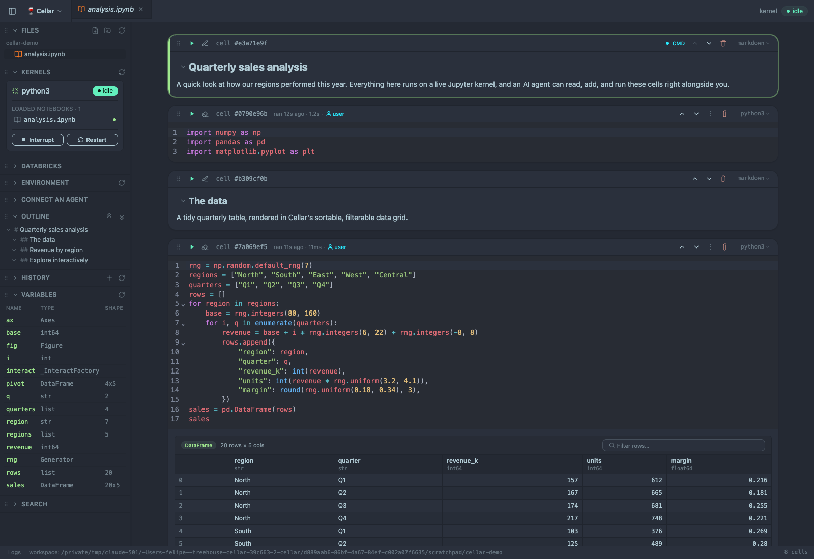
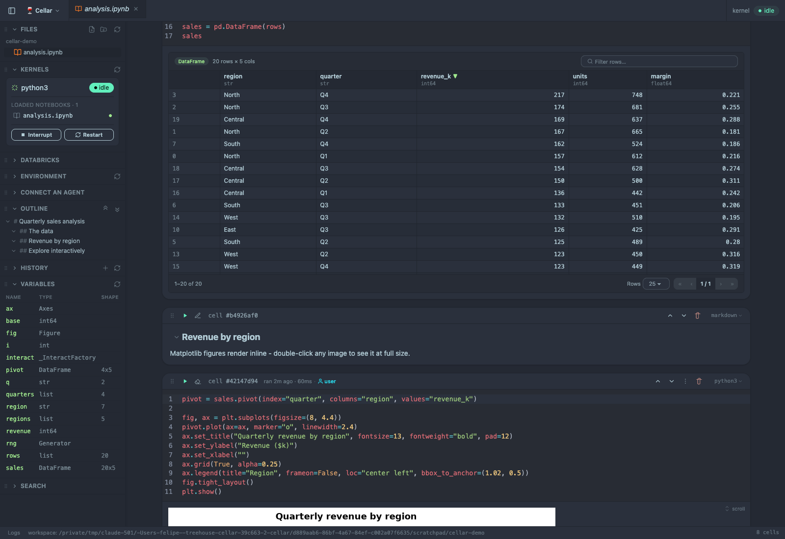
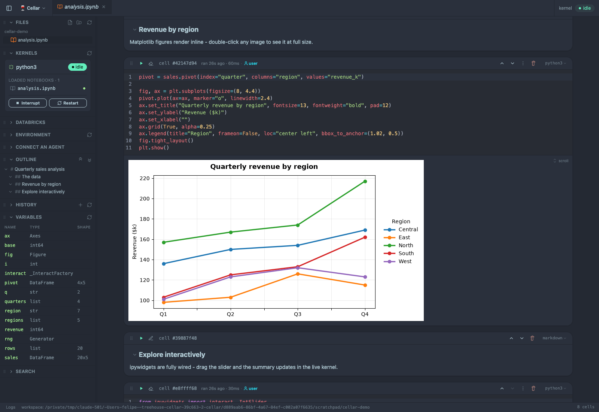

# Cellar

[](https://github.com/fbereilh/cellar/actions/workflows/ci.yml)
[](LICENSE)
[](https://github.com/fbereilh/cellar/releases)

**A Python notebook built for you and your AI agent to share.**

Cellar runs an interactive notebook in your browser on a live Jupyter kernel, with a first-class agent interface built in. Open a folder and both you and an AI agent (like Claude Code) work the *same* live notebook: the agent adds and runs cells, and the results stream into your browser in real time. No copy-paste, no context handoff, no drift.

It saves ordinary `.ipynb` files that open in vanilla Jupyter, and it keeps them git-clean so your diffs stay meaningful.



<p align="center"><em>One live notebook on its own kernel - markdown, code, and rich outputs, with an outline and live kernel inspector alongside. (Shown in the dark theme; a light theme ships too.)</em></p>

## Why Cellar

- 🤝 **You and your agent, one notebook.** An agent's runs and edits appear live in your open tab (streaming output, run badges, structural changes), and your edits flow back the same way - the agent is *told* when you change something under it, so it re-reads instead of treating your edit as a broken tool. You are never looking at stale state.
- ⚡ **One command, zero setup.** Run `cellar` in any folder. It resolves (or creates) the project venv with [`uv`](https://docs.astral.sh/uv/), starts the kernel, and opens your browser.
- 🔌 **Zero-config agent connection.** Cellar drops a `.mcp.json` in your workspace, so Claude Code opened in that folder connects automatically over MCP - and re-checks it on every start, so a deleted config heals itself. Other harnesses read their own file (Codex reads `.codex/config.toml`); the first run offers to add them, and `cellar harness add codex` does it any time.
- 🧹 **Git-friendly by design.** Clean-on-save strips volatile metadata and normalizes outputs, so re-running a notebook with the same results produces *no* git diff.
- 📊 **Rich outputs and data tools.** Matplotlib, Plotly, HTML, and full-size images render inline; sort and filter DataFrames in an interactive grid, and inspect the live namespace without leaving the page.
- 🧱 **Databricks, natively.** Point-and-click connect binds `spark` and a `WorkspaceClient` in the kernel, gives you a Unity Catalog browser, and uploads the notebook you have open into your own workspace folder.

## Install

**Homebrew (recommended).** Trust the formula once, then pick a channel:

```sh
brew trust --formula fbereilh/cellar/cellar
```

**Stable** - the latest tagged release. Recommended for most people:

```sh
brew install fbereilh/cellar/cellar
```

**Latest** - tracks `main` for the newest work, for the adventurous:

```sh
brew install --HEAD fbereilh/cellar/cellar
```

> **Why trust?** Homebrew requires a one-time trust before it will load a third-party tap's formula; `--formula` trusts just this one (recommended). The install then auto-taps `fbereilh/cellar` for you, so there's no separate `brew tap` step.

```sh
cellar --update
cellar --version
```

`cellar --update` fetches the newest version (install-method aware); `cellar --version` prints the version, sha, and install method.

<details>
<summary>From a git clone (dev)</summary>

```sh
git clone https://github.com/fbereilh/cellar.git
cd cellar
make setup
```

`make setup` installs deps, builds, and links `cellar` onto your PATH. `make update` (or `cellar --update`) pulls and rebuilds; run `make` with no target to list all commands.

For the full clone-to-run walkthrough, the kernel/venv resolution order, and every configuration knob, see **[docs/SETUP.md](docs/SETUP.md)**.
</details>

## Uninstall

Installed via Homebrew? Remove Cellar, then clean up what it pulled in:

```sh
brew uninstall cellar
brew autoremove
```

Use the fully-qualified `brew uninstall fbereilh/cellar/cellar` if another tap also provides a `cellar` formula.

> **Is `brew autoremove` safe?** Yes - it only removes formulae that were installed as another formula's dependency and are no longer needed by anything. Packages you installed on request are never touched, so a directly-installed `node` or `uv` stays. Run `brew autoremove --dry-run` first if you want to see the list before anything is removed.

**Optional** - Homebrew doesn't own everything Cellar creates. To also remove Cellar's local data and the tap:

```sh
rm -rf ~/.cellar
brew untap fbereilh/cellar
```

> **What's in `~/.cellar`?** Cellar's private Jupyter host env (`~/.cellar/host-venv`, which holds `jupyter-server` and is often hundreds of MB), its instance registry (`~/.cellar/instances/`), and your cross-project settings (`~/.cellar/settings.json` - today just the default Databricks upload prefix/postfix). All are optional to delete - Cellar recreates them on the next run, minus any settings you had chosen. Your projects' own `.venv` folders and notebooks live in your project directories and are never touched.

Ran it with Docker instead? Nothing was installed on the host - `docker rmi cellar` removes the image you built.

## Run with Docker

Prefer to skip installing anything? If you have Docker, you have Cellar. This path needs **only Docker on the host** - no Node, Python, or `uv` - and bakes a **reproducible, pinned kernel environment** into the image so every run is identical. It's meant for single-user, reproducible, zero-prerequisite use: Cellar has no auth, and one workspace and one Python environment per instance, so it is **not** for multi-user hosting.

Build the image once, then point it at any project folder:

```sh
git clone https://github.com/fbereilh/cellar.git && cd cellar
docker build -t cellar .

# from the project you want to work on:
docker run --rm --init \
  -v "$PWD":/workspace \
  -p 8888:8888 -p 39587:39587 \
  cellar
```

Open **http://localhost:8888** (the container prints it on startup) and you're in. Your folder is mounted at `/workspace`, so edits, new notebooks, and exports land straight back in it. `Ctrl-C` (or `docker stop`) shuts everything down cleanly.

Prefer Compose? It mounts the current directory and publishes both ports for you:

```sh
docker compose up --build   # then open http://localhost:8888
```

Once the image is published to a registry, you can skip the build entirely:

```sh
docker run --rm --init -v "$PWD":/workspace -p 8888:8888 -p 39587:39587 ghcr.io/fbereilh/cellar:latest
```

**The reproducible pinned env.** The image bakes a `uv`-managed virtualenv at `/opt/cellar-kernel` from [`docker/kernel-requirements.txt`](docker/kernel-requirements.txt) - a version-pinned scientific stack (`ipykernel`, `ipywidgets`, `numpy`, `pandas`, `matplotlib`, `scipy`) - and binds the Cellar kernel to it. Every container runs the exact same kernel env, with no network access at start. To make it yours:

- **Rebuild with your own pins** (the primary path): edit `docker/kernel-requirements.txt`, then `docker build -t my-cellar .`. Swap the base or tool versions with build args, e.g. `--build-arg NODE_IMAGE=node:22-bookworm-slim`.
- **Ad-hoc extras without a rebuild**: mount a requirements file and point `CELLAR_REQUIREMENTS` at it - `-v "$PWD/requirements.txt":/reqs.txt -e CELLAR_REQUIREMENTS=/reqs.txt` - and the entrypoint installs them into the kernel venv at startup (needs network).

**Connecting an agent.** The MCP endpoint is published on **http://localhost:39587/mcp** (Streamable HTTP). Point an HTTP-capable MCP client at it. (The in-container `cellar mcp` stdio bridge isn't used from the host, so the image writes no `.mcp.json` by default; set `-e CELLAR_MCP_CONFIG=1` to opt back in for an agent running *inside* the container.)

**Why this image, not a Jupyter base?** It's self-contained (Node + `uv` + Python, multi-stage build) rather than built on a `jupyter/docker-stacks` conda image. Cellar is `uv`-first by design - it manages every venv through `uv` - so a conda base would bolt on a second package manager Cellar never uses, and docker-stacks ships no Node. The container runs isolated (`CELLAR_ISOLATED=1`, no host registry or reaper), non-root, with fixed published ports and the app/MCP bound to `0.0.0.0`.

**Good to know (the honest caveats):**

- The kernel environment is the **container's** baked env, not a host `.venv`. Point Cellar at a different one by rebuilding, or with `-e CELLAR_VENV=/workspace/.venv` (it will `uv`-install `ipykernel` there at startup if missing).
- **Databricks** needs `~/.databrickscfg` mounted read-only (`-v "$HOME/.databrickscfg":/home/cellar/.databrickscfg:ro`, or uncomment the line in `docker-compose.yml`). A **PAT** profile works headless; OAuth's browser flow is awkward inside a container.
- Git blame and diff features need the repo mounted - it is, via `/workspace`.
- **Linux uid:** files are written as uid 1000 by default. If your host user differs, add `--user "$(id -u):$(id -g)"` so mounted files stay owned by you. (macOS Docker Desktop handles this for you.)
- **Single-user only** - don't expose the ports beyond `localhost`.

## Quick start

```sh
cd your-project
cellar
```

Your browser opens to a clean, empty workspace. Click **New notebook** (or open an existing `.ipynb` from the sidebar) and start writing and running cells. To bring in an agent, just open one (e.g. Claude Code) in the same folder - it auto-connects through the `.mcp.json` Cellar wrote, and you can watch it work alongside you.

`Ctrl-C` stops everything. Run `cellar ../other-repo` to open a different folder without `cd`-ing.

## Features

Everything you'd expect from a notebook, plus the things that make sharing one with an agent feel natural:

- **Code, Markdown, and SQL cells**, with a run queue, live run status, and staleness tracking so you always know what's fresh.
- **TeX math in markdown**: `$…$` and `$$…$$` typeset with KaTeX in markdown cells and `.md` previews, just like Jupyter. Fonts and styles are bundled, so it works offline; a bad formula shows an inline error instead of blanking the cell. (Prices like `$5 and $10` stay prose; an unfenced paragraph of `$ some-command` shell prompts does typeset, exactly as in Jupyter - put those in a code block. The HTML export shows math as literal `$…$` text.)
- **Rich outputs**: matplotlib, Plotly, rich HTML, and images you can double-click to view at natural size. HTML tables - a pandas `Styler`, a table you render with `IPython.display.HTML`, or one another library emits as rich HTML - get comfortable padding and alignment out of the box, so you don't need a `set_table_styles` helper on every table; anything you style yourself still wins. (Cellar states a few defaults directly on the header cells and the caption - their `color`, the caption's weight, and the index/caption alignment - so a *whole-table* rule such as `set_table_styles([{'selector': '', 'props': 'color:#444'}])` moves the data cells but not those; target them directly, e.g. `#T_xxxx th`, and yours wins.)
- **Interactive DataFrame grid**: pandas frames become a sortable, filterable, paginated table instead of a static repr.
- **Run metadata** on every cell: when it last ran, how long it took, and who ran it (you or an agent).
- **Export chosen cells to a `.py` module** (nbdev-style): mark the cells you want from each one's ⋮ menu, name a target file in the bar at the top of the notebook, and Cellar regenerates that module every time the notebook saves - a real, committable `.py` holding just those cells, not a mirror of the whole notebook (the **Export to .py** button rewrites it on demand). It only ever overwrites files it generated, so aiming the target at a module you wrote by hand is refused instead of clobbering it, and unmarking the last cell leaves the module on disk exactly as it was. Your agent can drive both halves - naming the target and choosing the cells - so "pull these helpers into `lib/utils.py`" is one instruction.
- **Checkpoints and undo** for agent actions - snapshot before a risky change and roll back.
- **Command palette** and Jupyter-style modal keyboard shortcuts for fast navigation, including **multi-cell selection**: `Shift`-click (or `Shift-J`/`Shift-K`) for a range, `Cmd`/`Ctrl`-click to pick out cells that aren't neighbours, `Cmd`/`Ctrl-A` for all of them - then delete, move, cut, copy, or change the type of the whole selection in one action.
- **Find in notebook** with `Ctrl`/`Cmd-F` - search across cell source, rendered markdown, and outputs (with regex), and jump between highlighted matches. You can also find a cell by its **id**: paste the handle shown in its toolbar (`cell #xxxxxxxx`, or the full id an agent quotes back at you) and the search jumps straight to that cell. Ids match on the first 8 characters or more, so an ordinary short query never gets mistaken for one - and a regex query searches content only.
- **Collapse a cell to its header** with the chevron on its toolbar: input *and* output hidden, leaving the cell id, the run controls, and a one-line source preview - so a long notebook folds down to something you can still read, run, and reorder. The choice is remembered per notebook and never written into the `.ipynb`.
- **Copy a cell's input or output** from the two buttons on its toolbar. Input gives you the source exactly as you'd edit it (a SQL cell copies its SQL); output gives a readable text form of what the cell shows - stream text, a traceback with the colors stripped, and an HTML table or a DataFrame as a tab-separated table you can paste straight into a spreadsheet (a truncated frame keeps pandas' `[N rows x M columns]` footer, and preformatted text keeps its alignment). A picture, a Plotly chart, a live widget, or a rich HTML object that is all script (a folium map, a Bokeh chart) has no text form, so a cell whose output is only those leaves the button disabled rather than pasting the `<folium.folium.Map ...>`-style placeholder Python prints for it.
- **Variable and DataFrame inspection** to peek into the live kernel namespace.
- **Git blame and diff gutters** right in the editor, and per-cell change bars in the notebook.
- **Workspace files in tabs**: open any file from the sidebar to read or edit it with syntax highlighting. Markdown and `.html` also get a **Source/Preview** toggle, so a saved plotly, bokeh, or nbconvert export just renders - inside a sandboxed frame that cannot reach the app. An open file **follows the disk**: when an agent, a terminal command, or another editor rewrites it, the tab updates in place - editor and rendered preview both - keeping your cursor, scroll position, and undo history. Your unsaved edits are never overwritten: if you have any, the change waits behind a banner offering **Reload** or **Keep mine**, and a file deleted underneath you keeps its buffer so saving recreates it. (Files over 2 MB refresh when you switch back to the window rather than the moment they change; notebooks aren't covered yet.)
- **Long notebooks stay fast**: only the cells near what you're looking at are kept in the page, so a several-hundred-cell notebook opens and scrolls like a short one. Find, the outline, running, and printing still reach every cell; **Settings → Windowed rendering** (or the **View** menu) turns it off if you'd rather have them all rendered at once.
- **Code roots** - point a notebook's kernel at a directory inside your workspace instead of the workspace itself, so one Cellar can serve several checkouts of the same repo. Create a worktree (`git worktree add roots/pr-482 some-branch`), pick it in the **Code root** bar at the top of the notebook, and that notebook's kernel runs there and imports from there - handy for a review notebook you re-run against a branch to see which findings clear. Two notebooks on two roots run side by side, each importing its own copy. Changing a root restarts that notebook's kernel, so its variables are cleared. Only the kernel moves: files, git, checkpoints, and the Python environment stay workspace-wide, so a notebook that declares no root behaves exactly as before. (A `.py` notebook stores no notebook-level metadata, so it cannot hold a code root - it shows no picker, and a root set on one is refused rather than lost on the next reload; convert it to `.ipynb` first. Worktrees under `roots/` show up as untracked in the outer repo - add `roots/` to your `.gitignore` if that bothers you. Git decorations for files *inside* a root are not accurate yet, since they are read from the outer checkout.)
- One kernel per notebook - isolated namespaces, notebooks running in parallel - with a sidebar showing what's actually loaded in memory.



<p align="center"><em>A bare <code>df</code> becomes an interactive grid - click a header to sort, type to filter, page through the rows.</em></p>



<p align="center"><em>Matplotlib, Plotly, and HTML outputs render inline, right where you ran the cell.</em></p>

## Working with agents (MCP)

Cellar exposes an in-process **MCP server** that shares the live document and kernel with the UI. Point any MCP client at the stdio command:

```sh
claude mcp add cellar -- cellar mcp
```

(or just run `cellar` and let the auto-written `.mcp.json` do it). On connect, the agent gets a house-style doctrine that frames the work as building *one coherent notebook*, plus a rich tool set: read the notebook map and live kernel state, add/edit/move cells, run them, and clear their outputs (`add_and_run` is the preferred write-and-execute flow; `clear_outputs` sheds a stale figure or a huge traceback without deleting the cell). It can also see the workspace's **code roots** (`list_roots`, with the branch each one has checked out) and point its own notebook at one (`use_notebook(name, root)`), so you can ask an agent to run its notebook against a specific checkout. Because the MCP session is independent of the kernel connection, restarting the kernel never drops the agent's session or your document.

**A harness that doesn't read `.mcp.json` gets set up too.** Codex reads a project `.codex/config.toml` and ignores `.mcp.json` entirely, so the first `cellar` run in a folder asks which other harnesses you use (and asks once more if a later Cellar learns to set up one it couldn't before). Any time after that:

```sh
cellar harness add codex      # or: claude, or all
cellar harness remove codex   # stop managing it (--strip also removes its entry)
cellar harness list           # what Cellar manages here, and each config's state
```

Cellar keeps the harnesses you've added **wired up**: every start it checks their config and repairs it if the entry is missing or was deleted. Claude Code is managed by default, which is what makes the zero-config `.mcp.json` above self-healing. The first-run question only ever *adds* - skipping it turns nothing off.

Writes merge into an existing config - your other MCP servers and settings are left alone - and re-running is a no-op rather than a duplicate. Your agent gets Cellar's tools while `cellar` is running in that workspace, since `cellar mcp` bridges to the live instance rather than starting one of its own.

**Your agent is told what *you* changed.** You keep editing the notebook while the agent works, so Cellar reports your changes on the agent's own next tool call: a short "the user deleted cell a1b2c3d4 and edited cell e5f6a7b8" note rides along with the result, and only when there is something to say. If the agent reaches for a cell you just deleted, the error names the cause ("the user deleted it just now in the Cellar UI") instead of the bare "no cell matches id" it gets for a made-up handle - so a normal edit of yours no longer reads to the agent (or to you, watching it) as a broken tool. The note is a bounded summary and the agent is told to re-read the notebook for the details; anything the agent did itself is left out, a *second* agent's edits are reported the same way as yours, and a cell you hid from the agent stays hidden, changes included.

**Your agent can see the plots it draws.** When a cell produces a figure, the run result carries the rendered chart as a real image the agent looks at - so it checks the axis labels and the data instead of saving the plot to a scratch file to read it back. It stays cheap by design: an oversized figure is downscaled for the reply (`get_full_output` with `size:"full"` returns the original), a run result inlines at most a few images, and the scan-style reads (the notebook map, cell reads, search) keep a terse `[image/png, 978×536, 44 KB]` marker instead of dumping every figure into the agent's context. A multi-cell run (`run_all` and friends) stays compact too: it flags which cells drew something with `has_image` and the agent fetches the ones that matter.

## Databricks

Open the sidebar's **Databricks** section, pick a profile and cluster, and click Connect. Cellar binds `spark` (a Databricks Connect session) and `w` (a `WorkspaceClient`) into the kernel, ready for `spark.read.table(...)`. A lazy Unity Catalog `catalog > schema > table` browser lets you click a table to drop a real, editable query cell into the notebook. Auth uses the SDK's own `~/.databrickscfg` profiles (PAT or OAuth) - no extra CLI required. The connected view shows the cluster name and connection status; if a session goes idle or drops, a **Reconnect** button restores it against the same cluster you already chose. If instead your saved profile sign-in has expired (a `databricks-cli` or OAuth profile whose refresh token died), Cellar shows the exact `databricks auth login --profile <name>` command to run in a terminal - that credential lives in the CLI's own store, so a browser sign-in cannot fix it, and Cellar won't offer a dead-end sign-in button. **Disconnect** ends that notebook's session and leaves you signed in; **Log out** (the quiet button under it) also signs you out - it disconnects every notebook app-wide and clears the sign-in Cellar itself cached, so the next connect authenticates again. It only ever deletes what Cellar's own browser sign-in minted: your `~/.databrickscfg` profiles, keyring entries and the databricks CLI's own token cache are left untouched, and the panel tells you afterwards exactly what was cleared. Agents can see and query the connection too, and can restore a dropped session or connect to a cluster you point them at - but they never start compute, drive the OAuth browser or sign you out, so a stopped cluster, a browser sign-in and a log out stay your call. While a query runs, a live Databricks-style progress bar shows overall task completion across stages and clears when the query finishes (queries faster than a couple of seconds skip the bar, just like Databricks).

**Upload notebook to workspace** (on the Cluster card, while connected) copies the notebook you have open into your own Databricks folder - `/Users/<you>/`, resolved from the connected identity, never a path you type - as a real Databricks notebook with its cells intact, not a flattened `.py` script. A `.py` jupytext or Databricks-source notebook uploads as a proper `.ipynb` too. Optional **Prefix** and **Postfix** fields wrap the notebook's own name, and both take date tokens - `{YYYY-MM-DD}`, `{YYYYMMDD}`, `{YYYY-MM}`, `{YYYYMM}`, `{YYYY}`, `{MM}`, `{DD}`, expanded against your local date - so `analysis.ipynb` can land as `2026-08-05_analysis` or `analysis_20260805` without renaming the file first. The tokens are listed as buttons under the fields that insert them at the caret (the braces are required), and a brace that isn't one of them is called out as a warning instead of silently uploading as written. The panel previews the resolved name as you type, and that preview is exactly what the workspace receives; an affix that would move the upload out of your own folder (a slash, a backslash or a control character) is refused with the reason on screen rather than quietly cleaned up. Your last-used pattern is remembered per project, and leaving both empty uploads exactly as it always did. Stamp every project the same way by setting **Settings → Default Databricks upload name** once - a project that has a prefix or postfix of its own always keeps it, and the default only fills in for one you never set (clear a project's field to opt it out). It reuses the connection you already made, so there is no second sign-in, and it only writes workspace files: nothing here starts, stops or restarts a cluster. Nothing is ever clobbered silently - if a notebook is already at that path, Cellar writes nothing and asks you to confirm a **Replace** first, and a path occupied by something that is not a notebook is refused outright. When it lands, the panel shows the workspace path plus an **Open in Databricks** link. A notebook so large it exceeds what a workspace import accepts is refused with the fix - clear its outputs, which are what make it that big.

A **SQL cell** holds a raw query that Cellar runs against that `spark` session and renders as an interactive grid. Its result is bound to `_sql_df` in the kernel, so a following Python cell can chain off the last SQL result. `_sql_df` is last-write-wins across the notebook, so with more than one SQL cell, name the binding by opening the cell with a `-- >> sales_df` line:

```sql
-- >> sales_df
SELECT region, sum(amount) AS amount FROM sales GROUP BY region
```

The result then binds to `sales_df` (and still to `_sql_df`), and no later SQL cell clobbers it. The line is a plain SQL comment, so the cell still reads as SQL anywhere else; it must be the first non-blank line, and the name must be a valid Python variable name that isn't already Cellar's (`spark`, `w`) - an unusable name fails the cell with a message saying why. Staleness knows about the binding: edit the query and the Python cells using its result go stale.

## Requirements

- **Node 18+**
- **Python 3.9+**
- **[`uv`](https://docs.astral.sh/uv/)** on your `PATH` (Cellar uses it for all venv and package management)

Or **just Docker** - see [Run with Docker](#run-with-docker) for a zero-prerequisite, reproducible-env alternative.

Cellar runs with **zero configuration** - it discovers your home directory, its own install location, and free ports at runtime. For the clone-to-run steps, kernel/venv resolution, and the full environment-variable reference (all optional, with defaults), see **[docs/SETUP.md](docs/SETUP.md)**.

## Testing

Two layers, run with:

```bash
npm run test
npm run test:e2e
```

- **Unit tests** (`tests/unit/`) guard the pure server logic. The crown jewel is clean-on-save: idempotent, git-clean round-trips, the metadata allowlist, memory-address scrubbing, and the notebook model (stable cell IDs, add/move/delete, duplicate-ID re-keying). These are the **must-pass gate and run on every PR in CI**.
- **E2E** (`tests/e2e/`) drives the real `cellar` launcher against a scratch workspace in a browser. The smoke spec (`smoke.spec.ts`) runs `6*7`, asserts `42` renders, and confirms the saved `.ipynb` is valid; the rest cover behavior only the full stack can show (e.g. `kernel-watchdog-probe.spec.ts` proves a long, silent cell is never aborted for being silent). They need the full kernel runtime (`uv` + `python3` + the cached host-venv), so they're a **local, best-effort** layer that skips itself when that runtime is absent. CI doesn't provide the kernel runtime, so they run locally, not there - the unit suite is what gates merges. Install the browser once with `npx playwright install chromium`. `npm run test:e2e` rebuilds the app first when `build/` is older than `src/` (the specs serve the production build, so a stale one would silently test uncompiled code) and runs two spec files at a time, ~2.5 min for the full suite.

## Contributing

Contributions are welcome - see **[CONTRIBUTING.md](CONTRIBUTING.md)** for dev
setup, the CI gate (`npm run build && npm run check && npm run test`), and the
project's conventions. Please also read the [Code of Conduct](CODE_OF_CONDUCT.md).

Found a security issue? Please report it privately - see **[SECURITY.md](SECURITY.md)**
(Cellar runs an arbitrary-code-execution kernel, so this matters).

See **[CHANGELOG.md](CHANGELOG.md)** for what changed in each release (it's
generated from the git history by [git-cliff](https://git-cliff.org) - never
hand-edited; run `make changelog` to regenerate), or the
[Releases](https://github.com/fbereilh/cellar/releases) page.

## License

Released under the [MIT License](LICENSE). Some editor syntax palettes were
ported in from other open-source projects; see [THIRD-PARTY.md](THIRD-PARTY.md)
for their notices.
